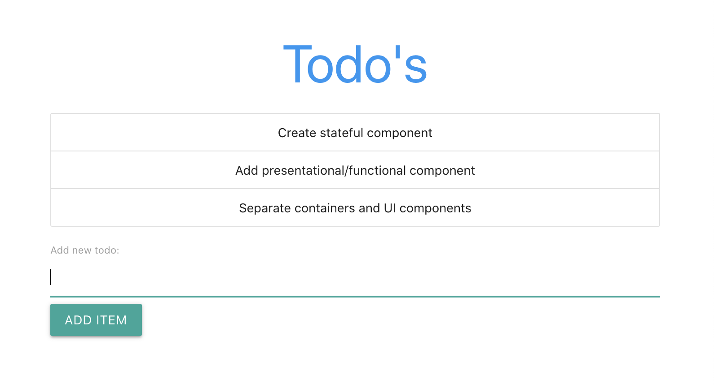
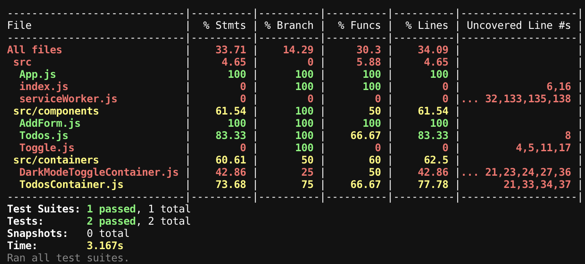

This project was bootstrapped with [Create React App](https://github.com/facebook/create-react-app).
# Todo app
After you deploy the instance, you can add and remove items from the Todo list

## Available Scripts

In the project directory, you can run:

### `npm start`

Runs the app in the development mode. 
Open [http://localhost:3000](http://localhost:3000) to view it in the browser.

The page will reload if you make edits. 
You will also see any lint errors in the console.

### `npm test`

Launches the test runner in the interactive watch mode `--watchAll=true` 
See the section about [running tests](https://facebook.github.io/create-react-app/docs/running-tests) for more information.

### `npx jest --coverage`

Launches the test runner with coverage enabled option using config inside `package.json`.
It will produce the report in the `coverage` directory.

### `npm run build`

Builds the app for production to the `build` folder. 
It correctly bundles React in production mode and optimizes the build for the best performance.

The build is minified and the filenames include the hashes. 
Your app is ready to be deployed!

See the section about [deployment](https://facebook.github.io/create-react-app/docs/deployment) for more information.

## Contribution

You are welcome to add new features, improve Dark mode toggle styles, and create new edge-case tests.